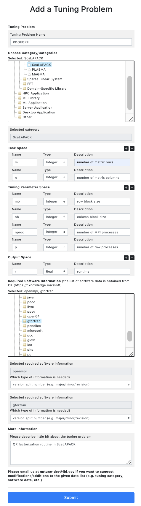
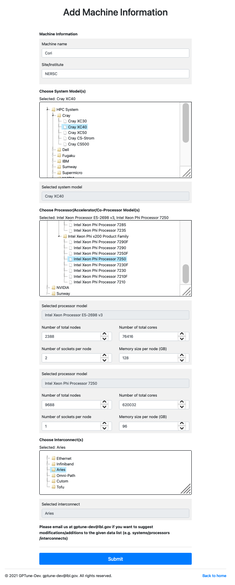

# History DB Repository

We offer two interfaces to access the repository (1) interactive web-dashboard or (2) an HTTPs RESTful API (called crowd-tune API).

## Interactive Dashboard

We provide a public shared database at [https://gptune.lbl.gov](https://gptune.lbl.gov) through [NERSC](https://www.nersc.gov)'s [Science Gateways](https://docs.nersc.gov/services/science-gateways/), where users can upload their performance data or download performance data provided by other users.
This section explains how to use the web interface for sharing performance data.

### User Privilege Levels

To assure provenance and avoid uploading bad data, the repository requires login credentials to submit any data.
If not registered, users can only access publicly available data.
Please log-in/sign-up at [https://gptune.lbl.gov/account/login/](https://gptune.lbl.gov/account/login/) to use the history database.
Once the user completes registration, the repository manager(s) will review the registration information and send you a confirmation email.
The user may need to wait for our approval to use all the nice features of the history database repository.
The different user privilege levels are summarized in the below figure and can also be found at [https://gptune.lbl.gov/membership](https://gptune.lbl.gov/membership).


There are multiple accessibility options for each submitted data: publicly available data, private data, and sharing with specific users/groups.
Registered (and approved) users can create specific user groups at [https://gptune.lbl.gov/repo/add-group/](https://gptune.lbl.gov/repo/add-group/).
The group information contains a list of user emails with their roles.
There are two user roles *owner* and *member*.
Users with the *owner* role can invite additional members to the group, but *member* can only view/download data which is accessible by the group.
Also, as shown in the below example, the user can view all the performance data submitted by the user at [https://gptune.lbl.gov/repo/user-dashboard/](https://gptune.lbl.gov/repo/user-dashboard/), and can alter the accessibility of data.


### Downloading Performance Data

To browse and download tuning data (e.g. function evaluation results, surrogate models) from the repository, we provide a web-based dashboard at [https://gptune.lbl.gov/repo/dashboard/](https://gptune.lbl.gov/repo/dashboard/).
In the dashboard, users first need to select a tuning problem from the drop-down menu.
The drop-down menu will show the names of available tuning problems along with their categories, e.g. { name: PDGEQRF, category : ScaLAPACK }.

Once a tuning problem is selected, the dashboard will print all available machine configurations, software configurations, and owner information (i.e. who submitted the data).
The user can check the machine/software/user configuration(s) that match the user's interests.
Then, the dashboard will print a table that contains all the filtered results.
The user can click the *Export JSON* button to export to the [JSON format](../static/overview.md), and download the JSON data and use it for autotuning.

The dashboard prints results based on the user's privilege level.
If the user is using the dashboard without signing in, the user will only be able to access publicly available data.


### Uploading Performance Data

To upload function evaluation results and/or surrogate model data, the user can use an online form at [https://gptune.lbl.gov/repo/upload/](https://gptune.lbl.gov/repo/upload/).
The user first needs to select the tuning problem and the machine used for generating the data.
If the user's tuning problem or machine is not shown in the drop-down menu, the user needs to add the tuning problem or machine information into the repository.
Please refer to the following sections: [Adding Tuning Problems](#adding-tuning-problem) and [Adding Machine Information](#adding-machine-information).

Once the tuning problem and the machine are selected, the user can upload data either by using a JSON data file generated by GPTune or by using a text data in the [JSON format](../static/overview.md).
For the given input data that may contain a large number of function evaluation results and surrogate model data, the shared repository automatically checks if there are duplicated data in the repository, and stores only data which are not in the repository.
The repository also checks if the submitted data match the problem space of the tuning problem and if the submitted data provide all the necessary machine configuration information.
Finally the web will print a message about how many function evaluation results and surrogate model data are added to the repository.


### Adding Tuning Problems

Before uploading any performance data, users need to define their tuning problems in the shared repository unless the same tuning problem already exists in the repository.
Based on the (well-defined) open tuning problem information, multiple users will be able to run autotuning for the same tuning problem and share performance data.

The list of available tuning problems is shown at [https://gptune.lbl.gov/repo/tuning-problems/](https://gptune.lbl.gov/repo/tuning-problems/).
To add a new tuning problem, the user can use an online form at [https://gptune.lbl.gov/repo/add-tuning-problem/](https://gptune.lbl.gov/repo/add-tuning-problem/).
As shown in the below screen shot, the user needs to define the tuning name and select appropriate category/categories of the tuning problem.
Then, the user needs to define the task space, the tuning parameter space, and the output space.
The user can also define which software and which type of information is needed when submitting performance data.
We obtained a tree-based structure of widely used software packages/tools from the [CK's soft](https://cknowledge.io/c/module/soft) database.
We believe that the provided list can cover many different software settings, but users can contact us at gptune-dev@lbl.gov if there are missing software packages/tools/datasets.

Regarding the tuning problem name, it is possible that different users might want to tune the same program but want to use different tuning options (e.g. different software configurations, different tuning parameter set, etc.).
The user does not need to worry about providing a unique name for the tuning problem name field.
The repository will assign a unique name by combining the user-provided tuning problem name by username and date of submission; hence users can differentiate between tuning problems, tuning the same program with different settings.



### Adding Machine Information

Similar to tuning problems, the user needs to define machine information using an online form at [https://gptune.lbl.gov/repo/add-machine/](https://gptune.lbl.gov/repo/add-machine/), unless the user's machine information is already available in the repository.
The available machine list is shown at [https://gptune.lbl.gov/repo/machines/](https://gptune.lbl.gov/repo/machines/).

The user first needs to provide the machine name and the site/institute information.
The user can then select the system model type (e.g. HPC systems manufacturer, cloud service provider, etc.).
Another important data field is to provide the processor types of the machine.
We have built a tree-based processor list from popular (HPC) processor vendors such as Intel, NVIDIA, IBM, AMD, ARM, and etc.
This list can cover almost all processor types in the TOP500 supercomputers, but the user can email us gptune-dev@lbl.gov to suggest modifications/additions to the given data list.
The user can select one processor type (homogeneous system) or multiple processor types (heterogeneous system) that make up the user's machine and provide information about the number of nodes/cores contained in the machine.
The user can finally select the interconnect(s) of the machine and submit the form.
Similar to adding a tuning problem, the repository will assign a unique machine name by combining the machine name by username and date of submission.
In case there are multiple records for the same machine (this is possible as the system can continue to consolidate more system resources), the user can still choose one machine record that best suits the user's tuning configurations.



## Programmable API

The programmable API is an API to access the repository via HTTPs based on REpresentational State Transfer (REST) principles, which means that the database resources can be identified via a uniform resource identifier (URL) and accessed in various programming languages like C++/Python.
This means that the user can query the best available tuning parameter to run a certain HPC code.

### API Format

To download performance data, the user can use a general URL form in the following, where *tuning_problem_name* is the name of tuning problem, *machine/software/user_configurations* contain lists of machine/software/user configurations to download.

```Bash
GET https://gptune.lbl.gov/direct-download/?tuning_problem_name=ScaLAPACK-PDGEQRF&machine_configurations=[ ... ]&software_configurations=[ ... ]&user_configurations=[ ... ] }
```

Similarly, the general URL form for uploading a function evaluation result is as follows, where *tuning_problem_name* is the name of tuning problem to be queried, and *function_evaluation* is the performance data to be uploaded.

```Bash
POST https://gptune.lbl.gov/direct-update/?tuning_problem_name=ScaLAPACK-PDGEQRF&function_evaluation={ ... }
```

The function evaluation data contains the tuning parameter configuration and its evaluated outputs, and the machine and software configuration on which the parameter configuration is evaluated.
For the JSON format describing a function evaluation data, please refer to Section JSON Format.

### API Key

Unlike the web-dashboard where the user can login from a web browser, all API requests need to contain an API key with a **x-api-key** header (e.g. { ''X-Api-Key'': ''your_API_key''}).
Each user can generate one or more API keys at [https://gptune.lbl.gov/account/access-tokens](https://gptune.lbl.gov/account/access-tokens).
When generating an API key, the user can select a display option whether the user agrees to display the user info or prefers to be anonymous.
Note that, users have to manage their API keys securely, because API keys are used instead of passwords.
Users have responsibility for any violations conducted using user API keys.

### Python example

As an example, we explain how to use this API from a Python script is using Python's [requests](https://docs.python-requests.org/en/latest/) module.
Using this feature, users can use own scripts to query performance data in the repository.

To query performance data, the user can use the requests module's *get* function as follows.
The user needs to provide an API key in the headers, and provide machine configurations and software configuration(s) that the user wants to allow downloading.
The function will then return a dictionary value (e.g. *r* in the below code) that contains the downloaded performance data (e.g. *r["perf_data"]*) as well as the request response data (e.g. "r.status_code==200" represents the request was success).

```Python
import requests
r = requests.get(url="https://gptune.lbl.gov/direct-download",
                 headers={"x-api-key":"your_api_key"},
                 params={"tuning_problem_name":"your_tuning_problem",
                         "machine_configurations": [
                             {"cori": {"haswell": {"nodes":1, "cores":32}}},
                             {"cori": {"knl": {"nodes":1, "cores":68}}}
                         ],
                         "software_configurations": [
                             {"gcc": {"version_split":[8,3,0]}}
                         ]
                 }
                 verify=False)
```

To upload performance data, the user can use the requests module's *post* function.
The user needs to provide an API key in the headers and provide the function evaluation.
The function returns a response message.

```Python
import requests
r = requests.post(url = "https://gptune.lbl.gov/direct-upload",
                  headers={"x-api-key":"your_api_key"},
                  data={"tuning_problem_name":"your_tuning_problem_name",
                        "function_evaluation_document": {
                            "task_parameter": { "m": 10, "n": 20 },
                            "tuning_parameter": { "mb": 2, "nb": 1 }
                            "evaluation_result": { "runtime": 6 }
                        }
                  }
                  verify=False)
```

### Run GPTune with an API key

Users can provide an API key to run GPTune autotuner with the HistoryDB repository.
In other words, historical performance data can be downloaded automatically, and function evaluation results can also be submitted to the repository automatically.
A more detailed example can be found [here](https://github.com/gptune/GPTune/blob/master/examples/PLASMA_TEST/dgels.py)

```Python
def objectives():
    return [result]

tuning_metadata = {
    "tuning_problem_name": "DGELS",
    "tuning_problem_category": "PLASMA",
    "historydb_api_key": "your_api_key",
    "use_crowd_repo": "yes",
    "machine_configuration": {
        "machine_name": "Cori",
        "haswell": { "nodes": 1, "cores": 32 }
    },
    "spack": ["plasma"]
}

machine, nodes, cores = GetMachineConfiguration(meta_dict=tuning_metadata)
problem = TuningProblem(input_space, parameter_space, output_space, objectives, constraints, constants=constants)
historydb = HistoryDB(meta_dict=tuning_metadata)
computer = Computer(nodes=nodes, cores=cores)

options = Options()
data = Data(problem)

gt = GPTune(problem, computer=computer, data=data, options=options, historydb=historydb)
gt.MLA(Input_task=[..], NS=NS, NI=NI)

```
