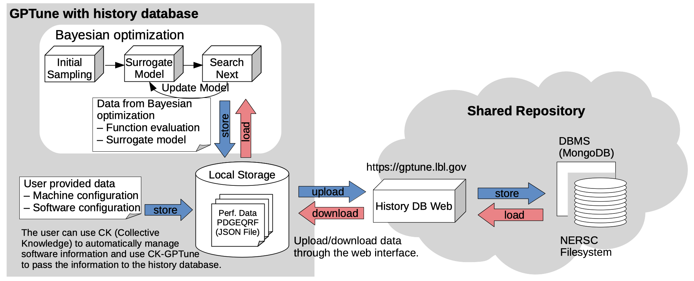

# Design



The figure illustrates the design of the history database.
Users can use the history database either by using [Python API](./userguide_api.md) in their GPTune driver code or by using a command line interface (CLI) provided by the workflow automation tool called [CK-GPTune](./ckgptune.md).
The GPTune history database can store and load performance data to and from performance data files with JavaScript Object Notation ([JSON](https://json.org)) format in the user's local storage.
Each tuning problem has a separate data file that contains all performance data (obtained by the user and/or downloaded from the shared public database) of the tuning problem.

Each data file contains the function evaluation results obtained from the GPTune's Bayesian optimization model.
The multitask learning autotuning (MLA) of GPTune relies on three information spaces: **input space (IS)**, **parameter space (PS)**, and **output space (OS)**.
IS contains all the input problems (i.e. tasks) that the application may encounter (e.g. the sizes of matrices, pointers to input files) and PS contains all the tuning parameter configurations to be optimized (e.g. size of row/column blocks).
OS is the output space for each of the scalar objective functions (e.g. measured runtime).
The history database stores these performance data into the JSON file right after evaluating each parameter configuration.
This practice ensures that no data is lost, in the case where  a long run with many parameter configurations does not complete.
If GPTune is run in parallel and multiple processes need to update performance data simultaneously, the history database allows one process to update the data file at a time based on simple file access control.

In addition to the information of IS, PS, and OS, the history database also records the meta-description like machine configuration and software information (e.g. which software libraries are used for that application) into the JSON file.
We offer two ways for users to provide machine/software configuration information.

* [HistoryDB API](./historydb_api.md): Users can provide machine/software configuration information manually using our Python API.
* [CK-GPTune](./ckgptune.md): Users can define the application's software dependencies with a meta-description file, then CK-GPTune detects the software information using the [Collective Knowledge (CK)](https://cknowledge.io) technology. Machine configuration still needs to be provided manually by the user.

Based on the provided information, users will be able to determine which data are relevant for learning from a possibly different machine or software versions or configurations.
Moreover, workflow automation will allow users to reproduce performance data from the same and different users.

We provide a public shared repository at [https://gptune.lbl.gov](https://gptune.lbl.gov) through [NERSC](https://www.nersc.gov)'s [Science Gateways](https://docs.nersc.gov/services/science-gateways), where users can upload their performance data obtained from GPTune and download performance data provided by other users.
In the shared repository, all submitted performance data is stored in a storage provided by [NERSC](https://www.nersc.gov) and internally managed by using [MongoDB](https://mongodb.com).
The shared database requires login credentials for users to submit their performance data.
Every submitted performance data can have multiple accessibility options: publicly available data, private data, or data that can be shared with specific users.
In other words, the shared repository allows anyone to browse and download publicly available data.

# JSON Format

In this section, we explain the JSON format to store performance data from GPTune.
Each tuning problem has a separate data file (e.g. *tuning_problem_name.json*) that contains all performance data (obtained by the user and/or downloaded from the shared public database) of the tuning problem.
Each JSON file has two labels *func_eval* and *model_data*.
As the name indicates, *func_eval* contains the list of all function evaluation results, and *surrogate_model* contains the list of each trained surrogate model's meta-data.

```Json
{
  "tuning_problem_name": "my_tuning_problem_name",
  "func_eval": [
    {
      /* function evaluation result */
    },
    {
      /* function evaluation result */
    },

    ...

    {
      /* function evaluation result */
    }
  ],
  "surrogate_model": [
    {
      /* surroagte model meta-data */
    },
    {
      /* surroagte model meta-data */
    },

    ...

    {
      /* surroagte model meta-data */
    }
  ]
}
```

<br>

## Function Evaluation Result

The following listing shows a function evaluation result of the QR factorization routine of [ScaLAPACK](http://www.netlib.org/scalapack/) for a given task/parameter configuration.
In the listing, **task_parameter** contains the information about the task parameter, and **tuning_parameter** contains the tuning parameter configuration, and its evaluation result is stored in **output**.
These information is collected automatically in GPTune if the user invoke the history database.

Each function evaluation data can also contain the information about the machine and software configuration to run the application (or the tuning problem).
The information related to the machine configuration includes the machine name (e.g. Cori) and the number of cores/nodes used.
The software information contains the versions of software packages that are used for compiling/installing the application.
The machine and software configurations are stored in **machine_configuration** and **software_configuration**, respectively.
Unlike task and tuning parameters, the machine and software information is not available in GPTune and needs to be given by the user.
Users can use [CK-GPTune](./ckgptune.md) to automatically detect the software dependencies or provide the information [manually](./userguide_api.md) in the application-GPTune driver code.

Also, when saving a function evaluation result, the data-creation time and a unique ID of the function evaluation are automatically generated and appended by GPTune.
This information can be useful if the user uploads the data into our shared repository.
If different users submit function evaluation results for the same task and parameter configurations, the database can differentiate between different function evaluation results based on their UIDs.

Example function evaluation result:

```Json
{
  "task_parameter": {
    "m": 30000,
    "n": 30000
  },
  "tuning_parameter": {
    "mb": 5,
    "nb": 13,
    "nproc": 136,
    "p": 9
  },
  "output": {
    "r": 15.148637
  },
  "machine_configuration": {
    "machine": "cori",
    "haswell": [
      "nodes": 8,
      "cores": 32
    ],
    "knl": [
      "nodes": 0,
      "cores": 0
    ]
  },
  "software_configuration": {
    "openmpi": {
      "version_str": "4.0.0",
      "version_split": [
        4,
        0,
        0
      ],
      "tags": "lib,mpi,openmpi"
    },
    "scalapack": {
      "version_str": "2.1.0",
      "version_split": [
        2,
        1,
        0
      ],
      "tags": "lib,scalapack"
    }
  },
  "time": {
    "tm_year": 2021,
    "tm_mon": 1,
    "tm_mday": 27,
    "tm_hour": 21,
    "tm_min": 22,
    "tm_sec": 22,
    "tm_wday": 2,
    "tm_yday": 27,
    "tm_isdst": 0
  },
  "uid": "cc7c03ec-6128-11eb-a40f-85c4081a47e2"
}
```

## Surrogate Model

This section explains what information is stored by GPTune for a GP surrogate model.
The below listing shows the information of a surrogate model for the IJ routine of [Hypre](https://computing.llnl.gov/projects/hypre-scalable-linear-solvers-multigrid-methods) for five different function evaluation results for task \{i: 200, j: 200, k: 200\}.

Label **hyperparameters** contains the hyperparameters values which are required to reproduce the surroagate model.
Here, we assume the GPTune's default modeling scheme, based on [Linear Coregionalization Model (LCM)](https://dl.acm.org/doi/abs/10.1145/3437801.3441621), is used.
Recall that, for a set of correlated objective functions for all the given tasks \\( \{ y_{i}(x) \}, {i\in 1..\delta}\\), LCM builds a joint model of the target functions \\( \{ f_{i}(x) \}, {i \in 1..\delta} \\), through the underlying assumption of linear dependence on latent functions \\( \{ u_{q} \} \\), each of which is an independent GP:
<script type="text/javascript" async
  src="https://cdnjs.cloudflare.com/ajax/libs/mathjax/2.7.7/MathJax.js?config=TeX-MML-AM_CHTML">
</script>
$$ f_{i}(x) = \sum_{q=1}^{Q}{a_{i,q}u_{q}(x)}$$
where \\( a_{i,q} \\) are hyperparameters, and \\( \{ u_{q} \}\\) are latent functions each of which is an independent GP:

$$ k_{q}(x,x') = \sigma_{q}^{2} exp(-\sum_{j=1}^{\beta}\frac{(x_{j}-{x_{j}}')^{2}}{I_{j}^{q}}) $$

where \\( \sigma_{q} \\) and \\( I_{j}^{q} \\) are also hyperparameters to be learned.
In addition to the aforementioned hyperparameters \\( a_{i,q} \\), \\( \sigma_{q} \\), \\( I_{j}^{q} \\), we use additional diagonal regularization parameters \\( b_{i,q} \\) and \\( d_{i} \\) for the covariance matrix during the LCM (for the details about the covariance matrix and the parameter search algorithm, please find [the GPTune paper](https://dl.acm.org/doi/abs/10.1145/3437801.3441621) in PPoPP 2021).
Hence, in the below example which considers one task (\\( Q=1 \\)) for 12 tuning parameters (\\( \beta=12 \\)), we store 16 hyperparameters in total (12 for \\( I_{j}^{q} \\) and 1 for each of \\( a_{i,q} \\), \\( \sigma_{q} \\), \\( b_{i,q} \\), \\( d_{i} \\)).
As another example, considering two tasks (\\( Q=2 \\)) for 12 tuning parameters (\\( \beta=12 \\)),, we need to store 36 hyperparameters in total (24 for \\( I_{j}^{q} \\), 4 for \\( a_{i,q} \\), 2 for \\( \sigma_{q} \\), 4 for \\( b_{i,q} \\), 2 for \\( d_{i} \\)).

**model_stats** stores the model's statistics information.
For the GPTune's LCM, we can store some statistics information such as *log_likelihood*, *neg_log_likelihood*, *gradients*, and *iteration* (how many iterations were required to converge the model).
Note that, trained surrogate models may or may not be meaningful for different problem spaces.
Therefore, the JSON data also contains task parameter information (**task_parameters**) and which function evaluation results were used (**func_eval**) to build the surrogate model, by containing the list of the UIDs of the function evaluation results.
The history database can load trained models only if they match the problem space of the given optimization problem.
Similar to function evaluation results, the data generation time and a unique ID of each surrogate model are also automatically appended by GPTune.

Example surroagte model data:

```Json
{
  "hyperparameters": [
    0.5140214197473143,
    1.037247070366763,
    337.6636254330382,
    15.04072992869631,
    5.107732628800839,
    2.9558180040483086,
    8.696644421366367,
    26.085771260561174,
    25.125605700207174,
    4.608683353484095,
    3.511325043265344,
    1.994878529737146,
    29.597204778514428,
    2.3554709171760972,
    9.999999586881094e-06,
    69.65076357886942
  ],
  "model_stats": {
    "log_likelihood": -35.22869969421778,
    "neg_log_likelihood": 35.22869969421778,
    "gradients": [
      -0.5379014374164104,
      0.02347984513751207,
      3.1845619569323703e-06,
      0.0019392480264629336,
      0.022834797398354992,
      -0.03018478674355551,
      0.022739720419626193,
      -0.00010746831896165282,
      0.002468829248110913,
      0.01631023320692664,
      0.030788540386404495,
      -0.024631175060550625,
      -0.27274355043218274,
      -6.198242202047159e-05,
      -3.262995507641375e-05,
      -0.2253219864474227
    ],
    "iteration": 65
  },
  "func_eval": [
    "09aab368-612d-11eb-8bf3-bbda784b918d",
    "09aae608-612d-11eb-8bf3-bbda784b918d",
    "09ab0c32-612d-11eb-8bf3-bbda784b918d",
    "09ab30fe-612d-11eb-8bf3-bbda784b918d",
    "09ab54ee-612d-11eb-8bf3-bbda784b918d"
  ],
  "task_parameters": [
    [
      200,
      200,
      200
    ]
  ],
  "problem_space": {
    "IS": [
      {
        "type": "int",
        "lower_bound": 20,
        "upper_bound": 1024
      },
      {
        "type": "int",
        "lower_bound": 20,
        "upper_bound": 1024
      },
      {
        "type": "int",
        "lower_bound": 20,
        "upper_bound": 1024
      }
    ],
    "PS": [
      {
        "type": "int",
        "lower_bound": 1,
        "upper_bound": 31
      },
      {
        "type": "int",
        "lower_bound": 1,
        "upper_bound": 31
      },
      {
        "type": "int",
        "lower_bound": 30,
        "upper_bound": 31
      },
      {
        "type": "real",
        "lower_bound": 0,
        "upper_bound": 1
      },
      {
        "type": "real",
        "lower_bound": 0,
        "upper_bound": 1
      },
      {
        "type": "int",
        "lower_bound": 1,
        "upper_bound": 12
      },
      {
        "type": "categorical",
        "categories": [
          "0",
          "1",
          "2",
          "3",
          "4",
          "6",
          "8",
          "10"
        ]
      },
      {
        "type": "categorical",
        "categories": [
          "-1",
          "0",
          "6",
          "8",
          "16",
          "18"
        ]
      },
      {
        "type": "categorical",
        "categories": [
          "5",
          "6",
          "7",
          "8",
          "9"
        ]
      },
      {
        "type": "int",
        "lower_bound": 0,
        "upper_bound": 5
      },
      {
        "type": "categorical",
        "categories": [
          "0",
          "3",
          "4",
          "5",
          "6",
          "8",
          "12"
        ]
      },
      {
        "type": "int",
        "lower_bound": 0,
        "upper_bound": 5
      }
    ],
    "OS": [
      {
        "type": "real",
        "lower_bound": -Infinity,
        "upper_bound": Infinity
      }
    ]
  },
  "modeler": "Model_LCM",
  "objective_id": 0,
  "time": {
    "tm_year": 2021,
    "tm_mon": 1,
    "tm_mday": 27,
    "tm_hour": 21,
    "tm_min": 52,
    "tm_sec": 47,
    "tm_wday": 2,
    "tm_yday": 27,
    "tm_isdst": 0
  },
  "uid": "0c5acce2-612d-11eb-8bf3-bbda784b918d"
}
```
